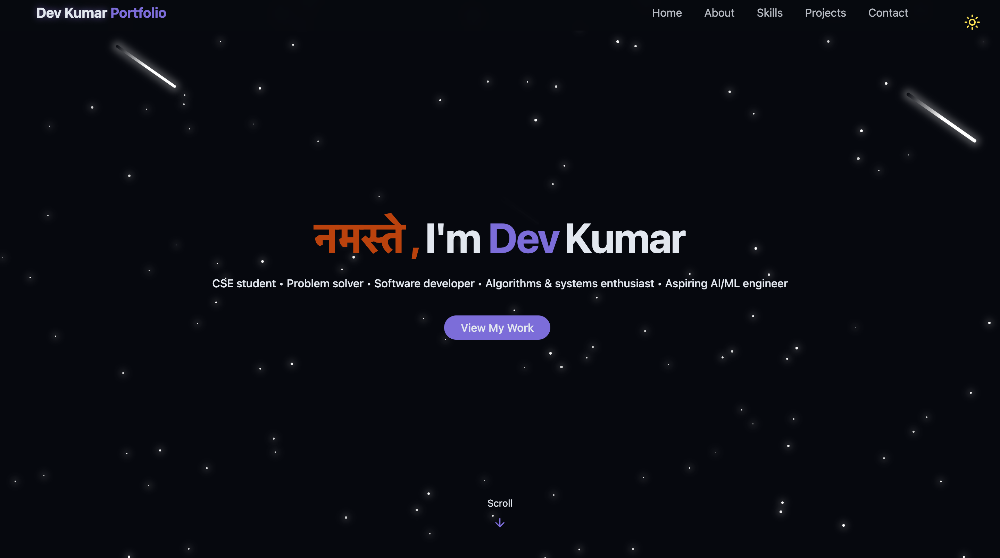
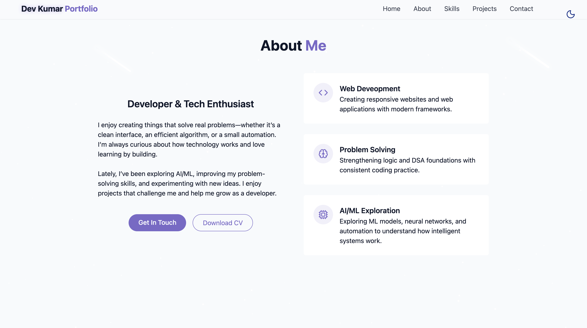
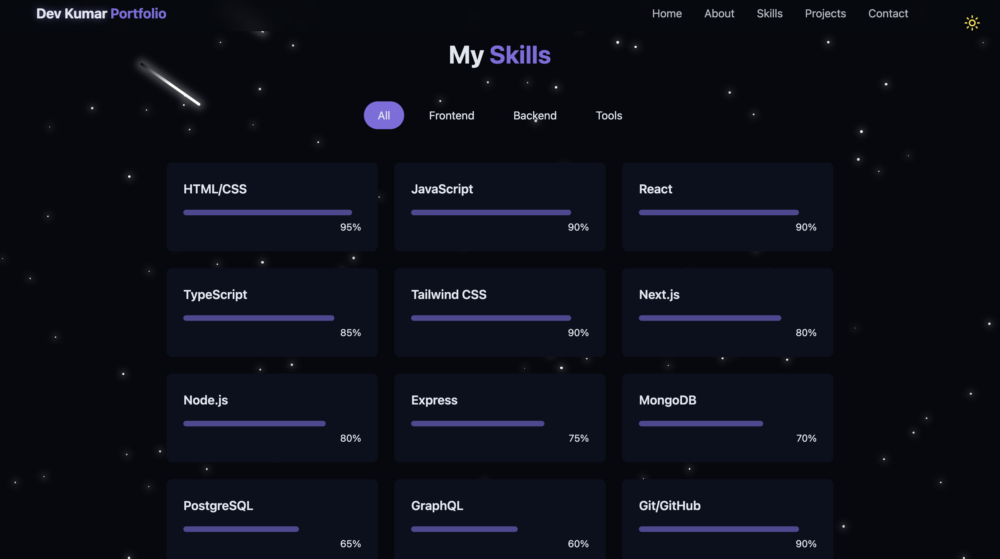
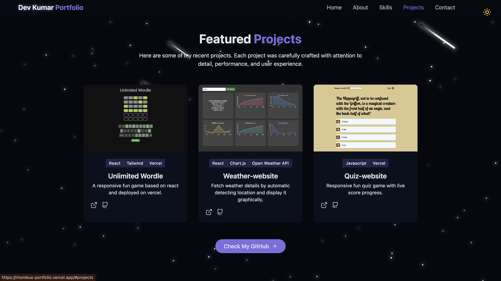
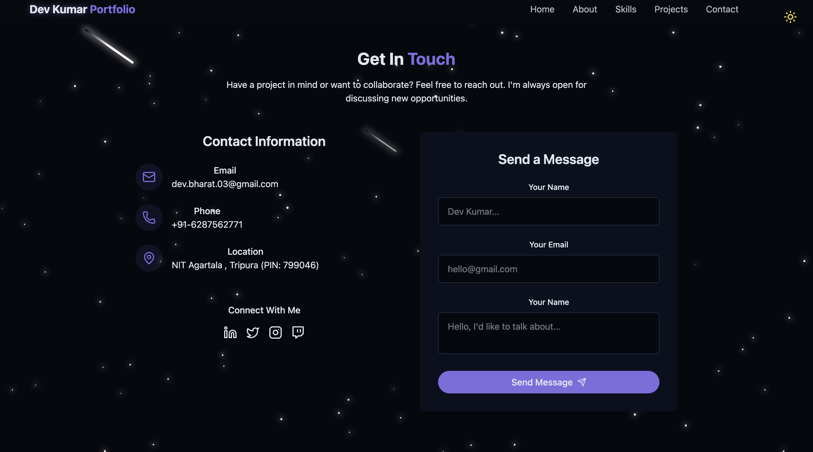

# 🌐 Dev Kumar — Personal Portfolio Website

A modern, responsive, and animated personal portfolio built using **React**, **Vite**, and **Tailwind CSS**.  
This website highlights my skills, projects, and experience through a clean, visually appealing design with smooth animations.


🔗 **Live Demo:** https://rhombus-portfolio.vercel.app/


---

## ✨ Features

### 🎨 Modern UI & Effects
- Smooth fade-in animations  
- Floating elements & meteor/star animations  
- Glow text, gradient borders, hover effects  
- Clean spacing with Tailwind container utilities  
- Beautiful light & dark theme support  
<<<<<<< HEAD

### 📱 Fully Responsive Layout
- Mobile-friendly design  
- Animated mobile navigation menu  
- Optimized for desktops, tablets, and phones  

### ⚡ Fast & Optimized
- Built with **Vite** for blazing-fast development  
- Tailwind CSS for utility-first styling  
- Minimal, clean React component structure  

---

## 🛠️ Tech Stack

| Category | Technologies |
|----------|--------------|
| **Frontend** | React, Vite |
| **Styling** | Tailwind CSS, Custom CSS Utilities |
| **Icons** | Lucide Icons |
| **Deployment** | Vercel |

---

## 📂 Folder Structure

```txt
my-portfolio/
│
├── public/               # Static assets (favicon, images)
├── src/
│   ├── components/       # Navbar, Hero, Skills, Projects, Footer, etc.
│   ├── assets/           # Images, icons, graphics
│   ├── styles/           # index.css + custom Tailwind utilities
│   ├── App.jsx           # Main app layout
│   └── main.jsx          # React entry point
│
├── index.html
├── package.json
├── vite.config.js
├── tailwind.config.js
├── README.md
└── .gitignore
```

---

## 🚀 Getting Started (Development)

### Clone the repository
```bash
git clone https://github.com/DevBarnwal/react-tailwind-my-portfolio.git
cd react-tailwind-my-portfolio
```

### Install dependencies
```bash
npm install
```

### Start development server
```bash
npm run dev
```

### Build for production
```bash
npm run build
```

### Preview production build
```bash
npm run preview
```

---

## 🎨 Custom Styling & Animations

This project uses extended Tailwind utilities defined inside `src/index.css`.

### Custom Utilities
- text-glow
- star
- meteor
- cosmic-button
- card-hover
- gradient-border

### Custom Animations
- float
- fade-in
- pulse-subtle
- meteor-trail

These utilities give the portfolio its **cosmic, dynamic visual style**.

---

## 📸 Screenshots

### 🏠 Homepage


### 🙋 About Section


### 🛠 Skills Section


### 📂 Projects Section


### 📞 Contact Section


---

## 📬 Contact

If you'd like to connect or collaborate:

**Dev Kumar**  
📧 Email: dev.bharat.03@gmail.com  
🔗 LinkedIn: https://www.linkedin.com/in/dev-kumar-0849a72b3/  
💻 GitHub: https://github.com/DevBarnwal  

---

## 📄 License

This project is licensed under the **MIT License**.  
Feel free to modify and use it for your own personal portfolio.

---

## ⭐ Support

If you found this project helpful, consider giving it a **⭐ star** on GitHub!
=======
